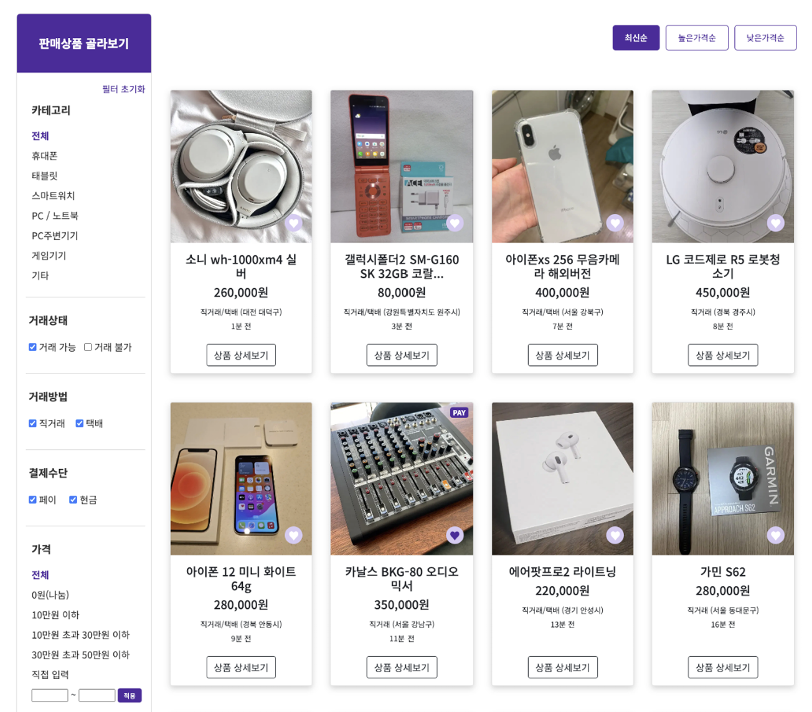
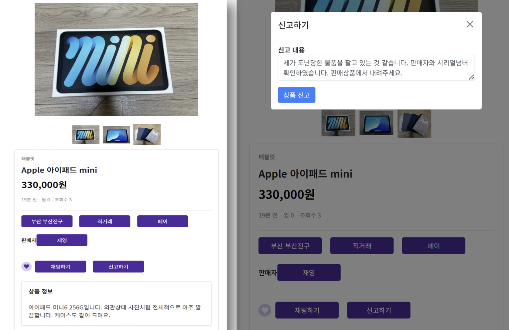
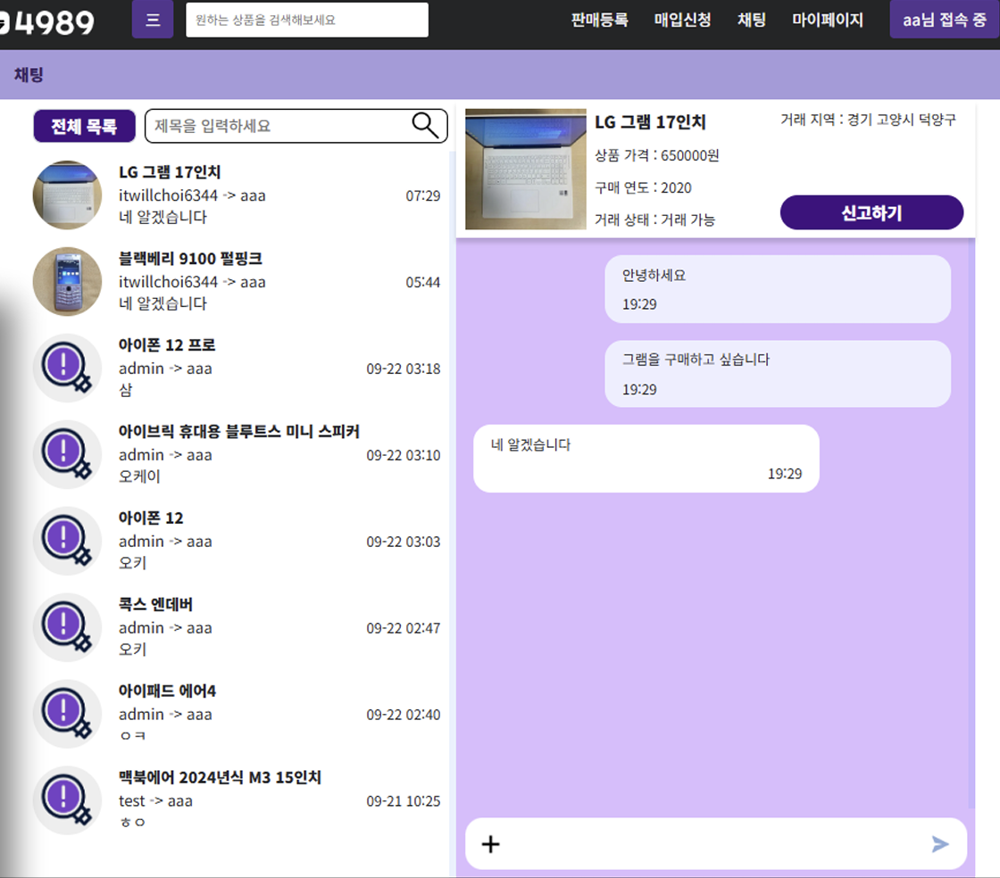
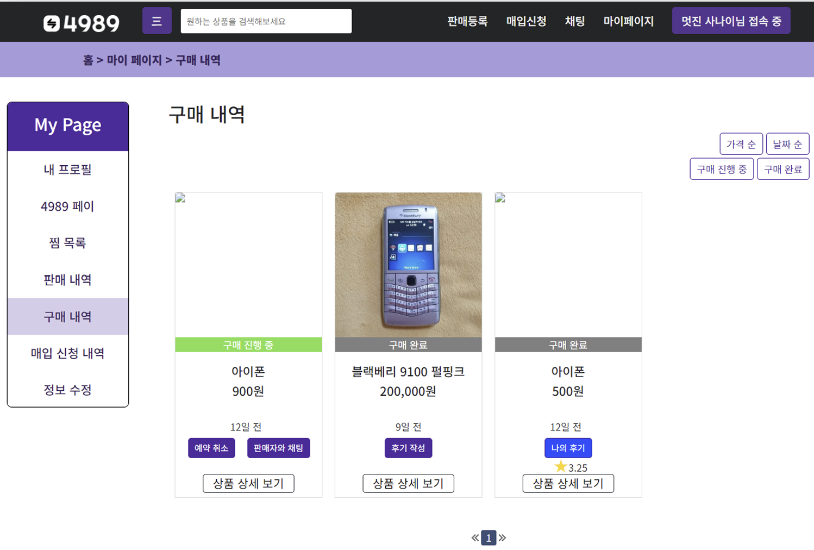

# Portfolio – Backend & Web Development Project

This repository highlights selected projects demonstrating my skills in:
- Program/Project Management (leading team projects from planning to delivery)
- Backend Development (Java, Spring, MyBatis, REST APIs)

## Featured Projects

### Itwill Project – Second-hand Item 4989
A project to develop a web-based marketplace for second-hand IT devices.  

#### Tech Stack
- Languages: Java, HTML, CSS, JavaScript  
- Framework/Library: Spring, MyBatis, jQuery, Bootstrap  
- DBMS: MySQL  
- API Integration: Naver OpenAPI, Kakao Developers  
- Tools: IntelliJ IDEA, ERD, Google Docs, Slack, Notion  

#### Screenshots for Key Features
Product List – Filtering, categories, wishlist, and product details  

Product Detail – Information from the product registration and chat with the seller

Chat – WebSocket-based live chat and product status updates  

My Page – Wishlist, sales history, purchase history, and edit user information   

#### The Other Features
- User registration, login, and profile management 
- Wishlist and cart functionality  
- Transaction management (buy/sell history)  
- Admin dashboard (user, transaction, product management)

## Contact
- LinkedIn: https://linkedin.com/in/choi6344 
- Email: choi6344@gmail.com

